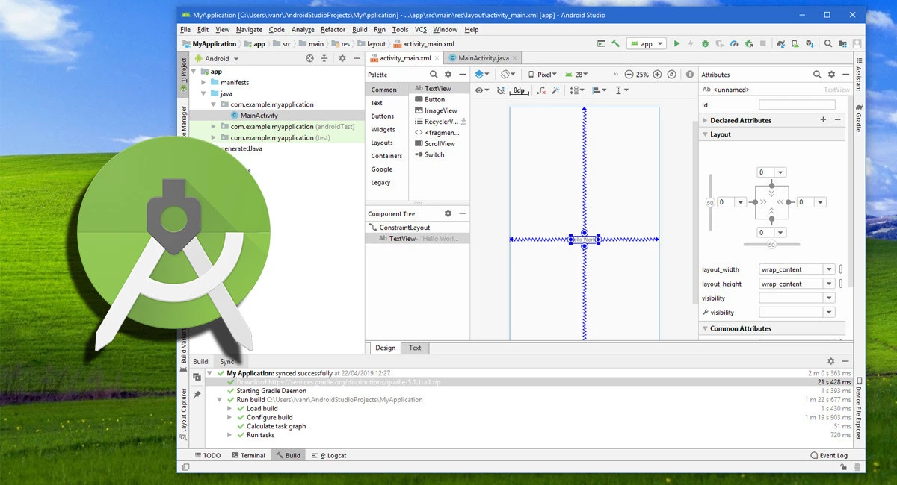
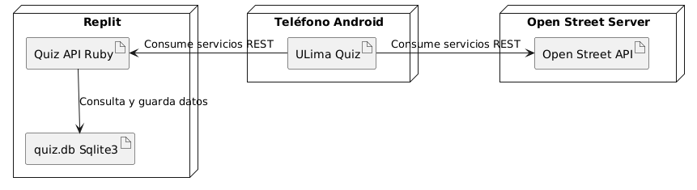
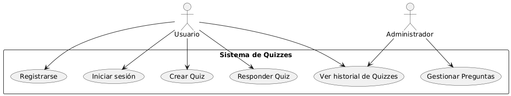
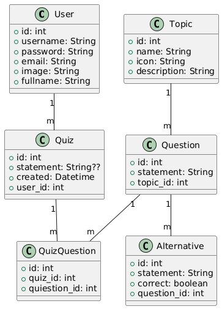

# 2025-1 Programación Móvil - Quiz

### Descripción del Aplicativo Móvil

Este aplicativo móvil es una plataforma interactiva dedicada a los aficionados del deporte, principalmente del fútbol, donde los usuarios podrán poner a prueba sus conocimientos sobre diversas disciplinas deportivas. El sistema se basa en una serie de preguntas de opción múltiple sobre temas como historia, jugadores, equipos, competiciones y estadísticas. Los usuarios podrán competir de manera individual <b>o en tiempo real con otros jugadores</b>, comparando sus resultados y obteniendo puntos por cada respuesta correcta.

Además, la aplicación contará con diferentes niveles de dificultad, desde preguntas más fáciles hasta desafíos complejos para expertos. Los usuarios podrán seguir su progreso a lo largo del tiempo, acceder a estadísticas personalizadas. Con una interfaz amigable y actualizaciones constantes con nuevos contenidos, el aplicativo promete ser una herramienta divertida y educativa para todos los apasionados del fútbol y otros deportes.

- [Configuración del Ambiente de Desarrollo](#configuración-del-ambiente-de-desarrollo)
- [Diagrama de Despliegue](#diagrama-de-despliegue)
- [Requerimientos no Funcionales](#requerimientos-no-funcionales)

Paso a paso que usaremos en el proyecto.

*<b>Figura 1: </b> Instalación de Adroid Studio*

## Diagrama de Despliegue

La arquitectura a usar será una aplicación web y una aplicación móvil. La aplicación móvil accede a la aplicación web a través de Internet, mientras que la aplicación web consulta y almacena datos en la base de datos. Este modelo ilustra cómo los clientes interactuán con la aplicación y cómo se gestionan los datos en el servidor.

*<b>Figura 02: </b> Diagrama de despliegue*

## Requerimientos no Funcionales

Disponibilidad: La API en Replit y el servidor de mapas deben estar accesibles en todo momento para garantizar el funcionamiento de la aplicación móvil.

Escalabilidad: La API y la base de datos SQLite3 deben manejar múltiples solicitudes concurrentes sin afectar el rendimiento.

Seguridad: Debe implementarse autenticación y cifrado en la comunicación entre la aplicación móvil, la API y el servidor de mapas para proteger los datos del usuario.

Rendimiento: Las consultas a la base de datos y el consumo de los servicios API deben ser rápidos para no afectar la experiencia del usuario.

Mantenibilidad: El código de la API y la aplicación móvil debe ser modular y bien documentado para facilitar futuras actualizaciones y correcciones.

Compatibilidad: La aplicación móvil debe funcionar en diferentes versiones de Android y ser compatible con distintas resoluciones de pantalla.

Usabilidad: La interfaz de la aplicación debe ser intuitiva y fácil de usar para que los usuarios puedan acceder a los quizzes y mapas sin complicaciones.

## Diagrama de Casos de Uso
El siguiente diagrama de casos de uso describe las interacciones dentro del Sistema de Quizzes, en el cual los usuarios pueden registrarse, iniciar sesión, crear y responder quizzes, así como visualizar su historial. Por otro lado, los administradores tienen funciones adicionales, como la gestión de preguntas y el acceso al historial de quizzes. Este modelo permite comprender los roles y funcionalidades clave dentro del sistema.

*<b>Figura 03: </b> Diagrama Casos de Uso*

A continuación se detallan los casos de uso:

| ID  | Caso de Uso             | Descripción                                      |
|-----|-------------------------|--------------------------------------------------|
| UC1 | Registrarse            | Permite a un usuario crear una cuenta en el sistema. |
| UC2 | Iniciar sesión         | Permite a un usuario autenticarse en el sistema. |
| UC3 | Crear Quiz             | Permite a un usuario generar un nuevo quiz con preguntas. |
| UC4 | Responder Quiz         | Permite a un usuario contestar un quiz disponible. |
| UC5 | Ver historial de Quizzes | Permite a un usuario o administrador revisar quizzes realizados. |
| UC6 | Gestionar Preguntas    | Permite a un administrador crear, editar o eliminar preguntas. |

Y el diagrama de clases es el siguiente:

*<b>Figura 04: </b> Clases*